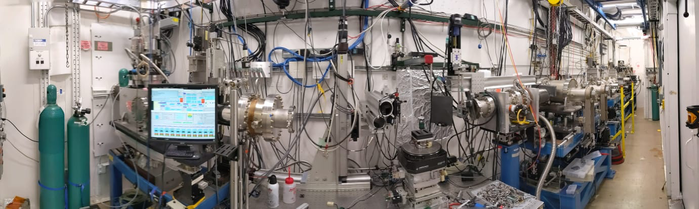

==========
29-ID Docs
==========

Manual and troubleshoting information to operate the APS beamline 29-ID

Content
-------

.. toctree::
   :maxdepth: 1

   source/about
   source/overview
   source/ops
   source/troubleshoot
   source/contacts
   source/publications

Contribute
----------

* `Documentation <https://github.com/decarlof/docs29id/tree/master/docs>`_

